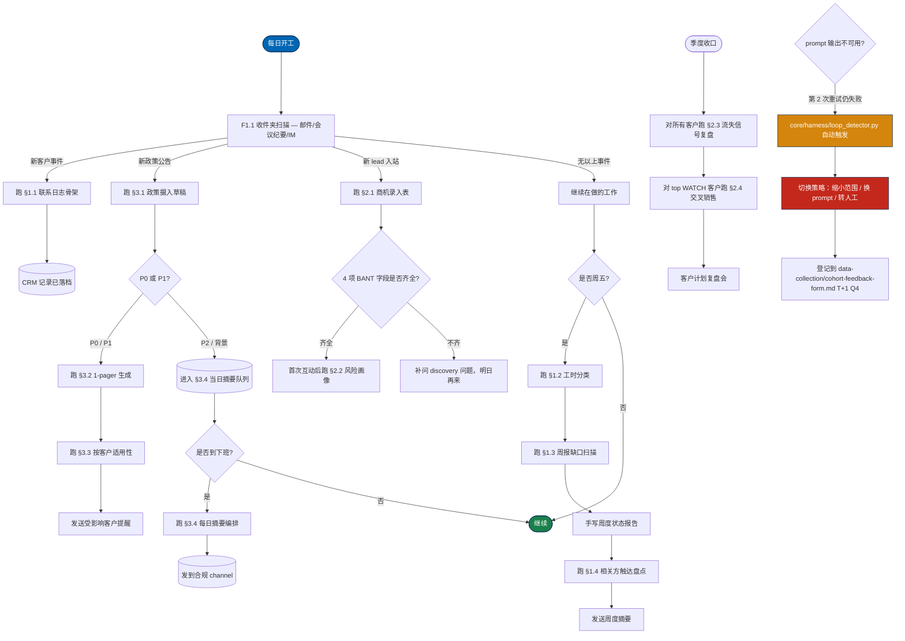

# SOP 流程图 · 业务分析 / 场景规划岗端到端工作流

> 把 BA 的日 / 周 / 季周期画成一张 Mermaid 流程图。这是一张"墙图"：决定要用哪条 prompt 之前先看一眼。
> 节点 ID 与可选的 `core/harness/sop_engine.py` 状态机一一对应（每个节点是一个状态）。

## 完整 SOP（≤ 20 节点）

## 节点 ID 参考（可选，用于 `sop_engine.py` 状态机）

| Node ID | 状态 | 触发 | 下一状态 |
|---------|------|------|---------|
| `START` | daily-start | 当班开始 | `S1` |
| `S1` | inbox-sweep | 扫未读 | 按事件类型分支 |
| `F1A` | contact-log | 新客户事件 | `CRM` |
| `F3A` | policy-ingest | 新公告 | `POLICYQ` |
| `F2A` | opportunity-intake | 新 lead | `Q1` |
| `S2` | resume-work | 无新事件 | `WEEKLY` |
| `WK1`-`WK5` | weekly-cycle | 周五 | 顺序 |
| `F3B`-`F3D` | policy-cycle | 高优先级公告 | 顺序 |
| `F2B`-`F2D` | opportunity-cycle | 已资质化 lead | 顺序 |
| `HARNESS` | loop-detector | 第 2 次重试失败 | `PIVOT` |
| `PIVOT` | strategy-change | 模型卡住 | `LOG` |
| `LOG` | failure-log | 始终 | 下一个周期的 `START` |

## 日 / 周 / 季入口

| 节奏 | 入口节点 | 典型耗时 | 典型出口 |
|------|---------|---------|---------|
| 每个班次开始 | `START` → `S1` | 15-30 分钟 | `S2`（继续在做的工作） |
| 每周五 | `WEEKLY` → `WK1` | 90 分钟 | `WK5`（周度摘要发出） |
| 每天下班 | `EOD` → `F3D` | 20 分钟 | `CHANNEL`（摘要发出） |
| 季度收口 | `QUARTER` → `F2C` | 4 小时 | `ACCT_PLAN` |

## 应急路径

同一个 prompt 在同一个输入上失败 2 次时：

1. 已安装 harness 时，`core/harness/loop_detector.py` 会自动触发（你不用手动调）
2. harness 把 PIVOT 建议写到 `state/loop-detector.log`
3. 你读一下建议，切换策略（缩小范围 / 换 prompt / 转人工）
4. 把这次失败登记到 `data-collection/cohort-feedback-form.md` T+1 Q4 — 这是下一轮 prompt 模板迭代的输入

未安装 harness 时，规则同样生效：手动检查"是否同一 prompt 同一输入连续失败 2 次"，触发即换策略。

第 3 次重试同一方案是硬规则禁止的。

## 打印版

要把流程图贴到墙上，用 [Mermaid Live Editor](https://mermaid.live)：把上面的 mermaid 代码块粘贴进去，导出 2× PNG，A3 打印。

---

AI 训战工作坊 · scenario-planner pack · 业务分析 / 场景规划岗
Agent Foundry Team
