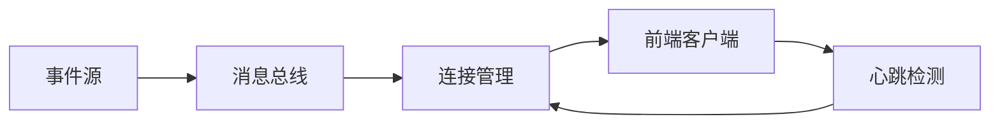

## 是什么

WebSocket 与 Server-Sent Events（SSE）是把服务端实时数据推送到前端的两种主流通道。
用它的效果是：用户不必反复刷新，进度条、聊天、行情、协作编辑都能秒级同步。

## 怎么用

1. 先判断是单向推送还是双向通信，让单向场景用 SSE 而双向场景用 WebSocket。
2. 在连接建立时做鉴权与心跳约定，让无效连接能被及时清理而不耗资源。
3. 用消息编号与重连补发让网络抖动后客户端能续上中断点。
4. 在服务端用消息总线扇出（Fan-out），让多个连接共享同一份事件源。
5. 对生产流量做并发与延迟压测，让上线后 SLA 心里有数。

## 架构图




# WebSockets and SSE Patterns

Real-time communication patterns for FastAPI: WebSockets for bidirectional, SSE for server-push.

## When to Activate

- Building real-time features (live updates, streaming LLM output, notifications)
- Choosing between WebSockets and SSE for a use case
- Implementing connection management (connect/disconnect, broadcast)
- Scaling real-time across multiple workers with Redis
- Debugging connection drops, backpressure, or missed events
- Implementing heartbeats and client-side reconnection

---

## WebSocket vs SSE — When to Use Which

| | WebSocket | SSE |
|---|---|---|
| Direction | Bidirectional | Server → client only |
| Protocol | `ws://` / `wss://` | Plain HTTP |
| Browser reconnect | Manual | Automatic (`EventSource`) |
| Proxy / CDN support | Needs config | Works everywhere |
| Use case | Chat, collaborative editing, games | Notifications, live feeds, LLM streaming |
| Load balancer sticky sessions | Required (or Redis) | Required (or Redis) |

**Rule of thumb:** use SSE unless the client needs to send frequent messages (more than form submit). LLM token streaming → SSE. Chat → WebSocket.

---

## SSE with FastAPI

### Basic SSE endpoint

```python
import asyncio
from fastapi import APIRouter
from fastapi.responses import StreamingResponse

router = APIRouter()

async def event_generator(task_id: str):
    """Yield SSE-formatted strings."""
    while True:
        data = await get_next_update(task_id)   # your async data source
        if data is None:
            break
        yield f"data: {data}\n\n"   # SSE format: "data: ...\n\n"
        await asyncio.sleep(0)       # yield control to event loop

@router.get("/tasks/{task_id}/stream")
async def stream_task(task_id: str):
    return StreamingResponse(
        event_generator(task_id),
        media_type="text/event-stream",
        headers={
            "Cache-Control": "no-cache",
            "X-Accel-Buffering": "no",   # disable nginx buffering
        },
    )
```

### SSE with Redis Streams (Agentex pattern)

```python
import json
import redis.asyncio as redis
from fastapi import APIRouter, Depends
from fastapi.responses import StreamingResponse

router = APIRouter()

async def stream_from_redis(task_id: str, client: redis.Redis):
    """Read Redis Stream and forward as SSE."""
    stream_key = f"task:{task_id}:stream"
    last_id = "0-0"

    while True:
        messages = await client.xread({stream_key: last_id}, count=10, block=5000)

        if not messages:
            # Heartbeat — keeps connection alive through proxies
            yield ": heartbeat\n\n"
            continue

        for _, entries in messages:
            for msg_id, fields in entries:
                last_id = msg_id
                event_type = fields.get("type", "message")
                data = fields.get("data", "")

                if event_type == "done":
                    yield f"event: done\ndata: {{}}\n\n"
                    return

                yield f"event: {event_type}\ndata: {data}\n\n"

@router.get("/tasks/{task_id}/events")
async def task_events(task_id: str, redis_client=Depends(get_redis)):
    return StreamingResponse(
        stream_from_redis(task_id, redis_client),
        media_type="text/event-stream",
        headers={"Cache-Control": "no-cache", "X-Accel-Buffering": "no"},
    )
```

### SSE message format

```
# Standard event
data: {"status": "running", "progress": 42}\n\n

# Named event (client listens with addEventListener)
event: progress\n
data: {"percent": 42}\n\n

# Event with ID (browser remembers for reconnect)
id: 123\n
event: update\n
data: hello\n\n

# Heartbeat / comment (keeps connection alive, ignored by client)
: ping\n\n
```

---

## WebSocket with FastAPI

### Basic endpoint

```python
from fastapi import WebSocket, WebSocketDisconnect, APIRouter
import json

router = APIRouter()

@router.websocket("/ws/{client_id}")
async def websocket_endpoint(websocket: WebSocket, client_id: str):
    await websocket.accept()
    try:
        while True:
            # Receive text or JSON
            raw = await websocket.receive_text()
            message = json.loads(raw)

            # Send response
            await websocket.send_text(json.dumps({"echo": message, "from": client_id}))
            # or: await websocket.send_json({"echo": message})
    except WebSocketDisconnect:
        print(f"Client {client_id} disconnected")
```

### Connection Manager (multi-client broadcast)

```python
from fastapi import WebSocket
import asyncio

class ConnectionManager:
    def __init__(self):
        self.active: dict[str, WebSocket] = {}

    async def connect(self, client_id: str, ws: WebSocket):
        await ws.accept()
        self.active[client_id] = ws

    def disconnect(self, client_id: str):
        self.active.pop(client_id, None)

    async def send(self, client_id: str, message: dict):
        ws = self.active.get(client_id)
        if ws:
            try:
                await ws.send_json(message)
            except Exception:
                self.disconnect(client_id)

    async def broadcast(self, message: dict, exclude: str | None = None):
        dead = []
        for cid, ws in self.active.items():
            if cid == exclude:
                continue
            try:
                await ws.send_json(message)
            except Exception:
                dead.append(cid)
        for cid in dead:
            self.disconnect(cid)

manager = ConnectionManager()

@router.websocket("/ws/{client_id}")
async def ws_endpoint(websocket: WebSocket, client_id: str):
    await manager.connect(client_id, websocket)
    try:
        while True:
            data = await websocket.receive_json()
            await manager.broadcast(
                {"from": client_id, "message": data["text"]},
                exclude=client_id,
            )
    except WebSocketDisconnect:
        manager.disconnect(client_id)
        await manager.broadcast({"system": f"{client_id} left"})
```

### Heartbeat (keep-alive for WebSocket)

```python
import asyncio
from fastapi import WebSocket

async def keep_alive(ws: WebSocket, interval: int = 30):
    """Send ping every N seconds to detect dead connections."""
    while True:
        await asyncio.sleep(interval)
        try:
            await ws.send_json({"type": "ping"})
        except Exception:
            break

@router.websocket("/ws/{client_id}")
async def ws_with_heartbeat(websocket: WebSocket, client_id: str):
    await websocket.accept()
    heartbeat = asyncio.create_task(keep_alive(websocket))
    try:
        while True:
            data = await websocket.receive_json()
            if data.get("type") == "pong":
                continue
            await handle_message(data)
    except WebSocketDisconnect:
        pass
    finally:
        heartbeat.cancel()
```

---

## Scaling with Redis Pub/Sub (multi-worker)

Without Redis, broadcast only reaches clients on the same worker process. Redis pub/sub fans out across all workers.

```python
import asyncio
import redis.asyncio as redis
from fastapi import WebSocket

class RedisConnectionManager:
    def __init__(self, redis_client: redis.Redis):
        self.redis = redis_client
        self.local: dict[str, WebSocket] = {}

    async def connect(self, client_id: str, ws: WebSocket, room: str):
        await ws.accept()
        self.local[client_id] = ws
        # Subscribe to room channel and forward to this WS
        asyncio.create_task(self._subscribe_and_forward(client_id, room, ws))

    async def _subscribe_and_forward(self, client_id: str, room: str, ws: WebSocket):
        async with self.redis.pubsub() as pubsub:
            await pubsub.subscribe(f"room:{room}")
            try:
                async for msg in pubsub.listen():
                    if msg["type"] == "message":
                        await ws.send_text(msg["data"])
            except Exception:
                pass

    async def publish(self, room: str, message: str):
        """Send to all clients in room across all workers."""
        await self.redis.publish(f"room:{room}", message)

    def disconnect(self, client_id: str):
        self.local.pop(client_id, None)
```

---

## Client-Side

### EventSource (SSE)

```typescript
const source = new EventSource(`/tasks/${taskId}/events`);

// Default event
source.onmessage = (event) => {
  const data = JSON.parse(event.data);
  console.log(data);
};

// Named events
source.addEventListener("progress", (event) => {
  const data = JSON.parse(event.data);
  setProgress(data.percent);
});

source.addEventListener("done", () => {
  source.close();
});

source.onerror = (error) => {
  // EventSource auto-reconnects after 3s by default
  console.error("SSE error", error);
};

// Manual close
source.close();
```

### WebSocket (browser)

```typescript
const ws = new WebSocket(`wss://api.example.com/ws/${clientId}`);

ws.onopen = () => {
  ws.send(JSON.stringify({ type: "join", room: "general" }));
};

ws.onmessage = (event) => {
  const msg = JSON.parse(event.data);
  if (msg.type === "ping") {
    ws.send(JSON.stringify({ type: "pong" }));
    return;
  }
  handleMessage(msg);
};

ws.onclose = (event) => {
  console.log("Closed:", event.code, event.reason);
  // Reconnect with backoff
  setTimeout(() => reconnect(), Math.min(1000 * 2 ** attempts, 30000));
};

ws.onerror = (error) => console.error("WS error", error);

// Send
ws.send(JSON.stringify({ type: "message", text: "Hello" }));
ws.close();
```

### React SSE hook

```typescript
function useSSE(url: string | null) {
  const [data, setData] = useState<string[]>([]);
  const [done, setDone] = useState(false);

  useEffect(() => {
    if (!url) return;
    const source = new EventSource(url);

    source.onmessage = (e) => setData(prev => [...prev, e.data]);
    source.addEventListener("done", () => { setDone(true); source.close(); });
    source.onerror = () => source.close();

    return () => source.close();
  }, [url]);

  return { data, done };
}
```

---

## Authentication

```python
# WebSocket auth via query param (token in URL — use wss:// only)
@router.websocket("/ws")
async def ws_auth(websocket: WebSocket, token: str = Query(...)):
    user = decode_jwt(token)
    if not user:
        await websocket.close(code=1008)   # policy violation
        return
    await websocket.accept()
    ...

# SSE auth via cookie or Authorization header (handled by FastAPI Depends)
@router.get("/stream")
async def sse_auth(
    request: Request,
    current_user: User = Depends(get_current_user),  # reads Authorization header
):
    return StreamingResponse(generator(current_user), media_type="text/event-stream")
```

---

## Red Flags

- **WebSocket when SSE is sufficient** — WebSocket requires sticky sessions or Redis coordination to scale and needs manual reconnection logic; if the server only pushes data (LLM tokens, task updates), SSE is simpler and supported everywhere with automatic browser reconnect
- **No heartbeat on long-lived connections** — proxies and load balancers close idle connections after 30–60 s by default; without a periodic ping/comment, clients silently lose their connection and receive no more events
- **In-process broadcast across multiple workers** — a `dict[str, WebSocket]` in memory only contains clients connected to the current worker; workers on different processes or machines never see each other's clients; use Redis pub/sub or Streams to fan out across all workers
- **Missing `X-Accel-Buffering: no` header on SSE** — nginx buffers upstream responses by default and holds SSE data until its internal buffer fills; the client sees bursts instead of real-time events; always set this header on SSE endpoints
- **Not closing `EventSource` after a `done` event** — `EventSource` auto-reconnects after any close; if the server ends the stream without the client calling `source.close()`, the browser reconnects and restarts the stream indefinitely
- **Blocking synchronous calls inside an SSE generator** — a `time.sleep()` or synchronous DB call inside an async generator blocks the entire event loop and freezes all other SSE connections on that worker; always use `await asyncio.sleep(0)` to yield control
- **`xread` with `block=0`** — blocking forever (`block=0`) holds the Redis connection open indefinitely and prevents graceful shutdown; use `block=5000` (5-second timeout) and loop, so the generator can detect disconnects and clean up

## Checklist

- [ ] SSE used for server-push only (LLM streaming, task updates, notifications)
- [ ] WebSocket used only when client sends messages frequently
- [ ] `Cache-Control: no-cache` and `X-Accel-Buffering: no` headers on SSE responses
- [ ] Heartbeat/ping sent every 30s to detect dead connections through proxies
- [ ] Redis pub/sub or Streams used for broadcast across multiple workers
- [ ] Client-side EventSource errors handled (auto-reconnects, but log errors)
- [ ] WebSocket auth via query param token (not headers — browsers can't set WS headers)
- [ ] `await asyncio.sleep(0)` inside SSE generators to yield to event loop
- [ ] Stream ended with `event: done` so client knows to close and stop reconnecting
- [ ] Redis Stream `xread` uses `block=5000` (5s timeout) not `block=0` (blocks forever)
