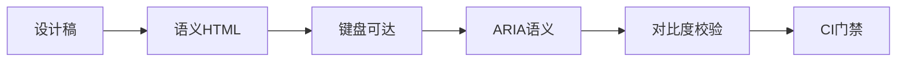

## 是什么

Accessibility（无障碍，A11y）是让残障用户与辅助技术（如读屏、键盘、语音）都能顺畅使用产品的工程实践。
用它的效果是：合规风险降低、用户群体扩大、整体交互质量提升（健全用户也受益）。

## 怎么用

1. 先用语义化 HTML 表达页面结构，让读屏软件能正确朗读层级与角色。
2. 为所有交互元素提供键盘可达路径，让不用鼠标的用户也能完成关键流程。
3. 用 ARIA（Accessible Rich Internet Applications）属性补齐动态组件的语义，让自定义控件不丢失可访问性。
4. 在颜色与字号上对照 WCAG 标准做对比度检查，让弱视用户也能舒服阅读。
5. 把无障碍检查接入 CI 自动化，让回归在合并前被发现而不是等用户投诉。

## 架构图




# Accessibility

Build UIs that work for everyone — keyboard users, screen reader users, users with motor impairments, low-vision users, and users in constrained environments.

## When to Activate

- Building or reviewing UI components (forms, modals, menus, tables)
- Implementing keyboard navigation or focus management
- Auditing a page or component for WCAG conformance
- Adding ARIA attributes to custom interactive widgets
- Reviewing color palette or typography choices for contrast
- Writing E2E tests that must be accessible-first
- Preparing for an accessibility audit or compliance review

## WCAG Conformance Levels

| Level | What it means | Typical target |
|---|---|---|
| A | Bare minimum — removes critical blockers | Never ship below this |
| AA | Standard legal/compliance baseline (most regulations) | Default target |
| AAA | Enhanced — not always achievable for all content | Aim where practical |

Most legal requirements (ADA, WCAG 2.1 AA, EN 301 549) map to **AA**.

## Semantic HTML First

Use the right element before reaching for ARIA.

```html
<!-- BAD: div soup -->
<div class="btn" onclick="submit()">Submit</div>
<div class="nav"><div class="nav-item">Home</div></div>
<div class="heading">Page Title</div>

<!-- GOOD: native semantics -->
<button type="submit">Submit</button>
<nav><a href="/">Home</a></nav>
<h1>Page Title</h1>
```

### Landmark Regions

```html
<header>          <!-- banner landmark -->
<nav>             <!-- navigation landmark -->
<main>            <!-- main landmark (one per page) -->
<aside>           <!-- complementary landmark -->
<footer>          <!-- contentinfo landmark -->
<section aria-label="Featured articles">  <!-- region landmark (needs label) -->
```

### Heading Hierarchy

```html
<!-- BAD: skipped levels, visual-only sizing -->
<h1>Site Name</h1>
<h3>Section Title</h3>   <!-- skipped h2 -->
<span class="h2-style">Visual heading, not semantic</span>

<!-- GOOD: sequential, logical outline -->
<h1>Page Title</h1>
  <h2>Section</h2>
    <h3>Subsection</h3>
  <h2>Another Section</h2>
```

## ARIA

Use ARIA only when native HTML cannot express the semantics.

### Rule of thumb

```
1. Use native HTML element                → <button>, <input>, <select>
2. Use native attribute                  → disabled, required, checked
3. Use ARIA role + state + property      → last resort for custom widgets
```

### Common Roles

```html
<!-- Roles that convey widget type -->
<div role="dialog" aria-modal="true" aria-labelledby="dialog-title">
<div role="alertdialog" aria-labelledby="alert-title" aria-describedby="alert-desc">
<div role="tablist"><div role="tab" aria-selected="true"><div role="tabpanel">
<ul role="listbox"><li role="option" aria-selected="false">

<!-- Roles for landmarks (prefer native elements) -->
<div role="banner">     <!-- prefer <header> -->
<div role="main">       <!-- prefer <main> -->
<div role="navigation"> <!-- prefer <nav> -->
```

### States and Properties

```html
<!-- Expandable widgets -->
<button aria-expanded="false" aria-controls="menu-id">Menu</button>
<ul id="menu-id" hidden>...</ul>

<!-- Required and invalid fields -->
<input aria-required="true" aria-invalid="true" aria-describedby="error-id">
<span id="error-id" role="alert">Email is required</span>

<!-- Live regions -->
<div aria-live="polite">   <!-- non-urgent updates (status messages) -->
<div aria-live="assertive" role="alert">  <!-- urgent (errors) -->

<!-- Labelling -->
<button aria-label="Close dialog">✕</button>
<input aria-labelledby="label-id hint-id">  <!-- multiple labels -->
<table aria-describedby="table-desc">
```

### ARIA Anti-Patterns

```html
<!-- BAD: redundant roles -->
<button role="button">      <!-- button already has this role -->
<ul role="list">            <!-- ul already has this role -->
<a href="/" role="link">    <!-- redundant -->

<!-- BAD: presentational role on interactive element -->
<button role="presentation">Submit</button>

<!-- BAD: ARIA label overrides visible text -->
<button aria-label="Click here to proceed">Submit order</button>
<!-- Screen reader says "Click here to proceed" — inconsistent with visual -->
```

## Keyboard Navigation

### Focus Order

```html
<!-- Logical DOM order = logical tab order -->
<!-- Avoid tabindex > 0 — it creates a separate, confusing tab sequence -->

<!-- BAD -->
<button tabindex="3">First visually</button>
<button tabindex="1">Second visually</button>

<!-- GOOD: use DOM order, override with tabindex="0" only to add focusability -->
<div tabindex="0" role="button">Custom focusable</div>

<!-- Remove from tab order when visually hidden -->
<div hidden>           <!-- tabindex automatically removed -->
<div aria-hidden="true" tabindex="-1">  <!-- hidden from AT, not in tab order -->
```

### Keyboard Patterns by Widget

| Widget | Keys required |
|---|---|
| Button | `Enter`, `Space` |
| Link | `Enter` |
| Checkbox | `Space` to toggle |
| Radio group | `Arrow` keys within group, `Tab` to leave |
| Select / Listbox | `Arrow` keys, `Enter`, `Escape` |
| Modal dialog | `Tab`/`Shift+Tab` trapped inside, `Escape` closes |
| Menu | `Arrow` keys, `Escape`, `Enter`/`Space` to select |
| Tabs | `Arrow` keys between tabs, `Tab` into panel |
| Slider | `Arrow` keys, `Home`, `End` |

### Focus Management

```typescript
// Move focus into dialog when it opens
function openModal(modalEl: HTMLElement) {
  const firstFocusable = modalEl.querySelector<HTMLElement>(
    'button, [href], input, select, textarea, [tabindex]:not([tabindex="-1"])'
  );
  firstFocusable?.focus();
}

// Trap focus inside modal
function trapFocus(modalEl: HTMLElement, event: KeyboardEvent) {
  if (event.key !== "Tab") return;
  const focusable = modalEl.querySelectorAll<HTMLElement>(
    'button:not([disabled]), [href], input:not([disabled]), select, textarea, [tabindex]:not([tabindex="-1"])'
  );
  const first = focusable[0];
  const last = focusable[focusable.length - 1];

  if (event.shiftKey && document.activeElement === first) {
    last.focus(); event.preventDefault();
  } else if (!event.shiftKey && document.activeElement === last) {
    first.focus(); event.preventDefault();
  }
}

// Return focus to trigger when dialog closes
function closeModal(triggerEl: HTMLElement) {
  triggerEl.focus();
}
```

## Color and Visual Design

### Contrast Ratios (WCAG AA)

| Text | Minimum ratio | Enhanced (AAA) |
|---|---|---|
| Normal text (< 18pt / 14pt bold) | 4.5:1 | 7:1 |
| Large text (≥ 18pt / 14pt bold) | 3:1 | 4.5:1 |
| UI components, icons, graphical elements | 3:1 | — |
| Decorative content | No requirement | — |

```css
/* BAD: low contrast */
color: #999;          /* #999 on white = 2.85:1 */
color: #767676;       /* borderline 4.54:1 — just passes but risky */

/* GOOD: reliable contrast */
color: #595959;       /* 7.0:1 on white */
color: #0066cc;       /* 5.74:1 on white — accessible blue */
```

### Don't Rely on Color Alone

```html
<!-- BAD: color-only status -->
<span class="status-dot green"></span>

<!-- GOOD: color + text/icon -->
<span class="status-dot green" aria-label="Active"></span>Active

<!-- BAD: error indicated only by red border -->
<input class="error-border">

<!-- GOOD: error icon + text + aria-invalid -->
<input aria-invalid="true" aria-describedby="err">
<span id="err">⚠ Email is required</span>
```

### Motion and Animation

```css
@media (prefers-reduced-motion: reduce) {
  *, *::before, *::after {
    animation-duration: 0.01ms !important;
    animation-iteration-count: 1 !important;
    transition-duration: 0.01ms !important;
  }
}
```

## Forms

```html
<!-- BAD: placeholder as label -->
<input type="email" placeholder="Enter email">

<!-- GOOD: explicit label, associated by for/id -->
<label for="email">Email address</label>
<input id="email" type="email" autocomplete="email"
       aria-required="true" aria-describedby="email-hint">
<span id="email-hint">We'll only use this to send your receipt.</span>

<!-- Group related fields -->
<fieldset>
  <legend>Shipping address</legend>
  <label for="street">Street</label>
  <input id="street" type="text" autocomplete="street-address">
</fieldset>

<!-- Error association -->
<label for="phone">Phone number</label>
<input id="phone" type="tel" aria-invalid="true" aria-describedby="phone-error">
<span id="phone-error" role="alert">Enter a valid 10-digit phone number</span>
```

## Images and Media

```html
<!-- Informative image: describe the content -->


<!-- Decorative image: empty alt suppresses announcement -->


<!-- Icon button: label the action, not the icon -->
<button aria-label="Delete item"><svg aria-hidden="true">...</svg></button>

<!-- Complex image: long description -->
<figure>
  
  <figcaption><!-- or link to detailed description --></figcaption>
</figure>

<!-- Video: captions + audio description -->
<video>
  <track kind="captions" src="captions-en.vtt" srclang="en" label="English" default>
  <track kind="descriptions" src="descriptions.vtt" srclang="en" label="Audio descriptions">
</video>
```

## Testing

### Manual checklist (do for every component)

1. Tab through the page — every interactive element reachable?
2. Nothing requires a mouse — all actions completable by keyboard?
3. Focus indicator always visible?
4. Test with screen reader (NVDA/Firefox on Windows, VoiceOver/Safari on Mac)

### Automated tools

```bash
# Axe CLI
npx axe http://localhost:3000 --reporter cli

# Pa11y
npx pa11y http://localhost:3000

# Playwright + axe-core
npm install @axe-core/playwright
```

```typescript
// Playwright accessibility scan
import { checkA11y, injectAxe } from "axe-playwright";

test("home page has no accessibility violations", async ({ page }) => {
  await page.goto("/");
  await injectAxe(page);
  await checkA11y(page, null, {
    detailedReport: true,
    detailedReportOptions: { html: true },
  });
});
```

### Contrast check

```bash
# Check contrast via CLI
npx contrast-ratio "#595959" "#ffffff"

# Or use browser DevTools: Accessibility panel → Contrast ratio
```

## Red Flags

- **`aria-label` on every element** — ARIA overrides native semantics; use semantic HTML first and add ARIA only when native elements can't express the required role or state
- **`role="button"` on a `<div>` or `<span>`** — custom button roles require manually implementing keyboard behavior; use `<button>` and get focus, Enter, and Space for free
- **`alt=""` on informational images** — empty alt hides the image from screen readers entirely; empty alt is only correct for purely decorative images that convey no content
- **`placeholder` as the only label** — placeholder text disappears on focus and has insufficient contrast ratio; every input must have an associated visible `<label>` element
- **`outline: none` without a visible replacement** — removing the default focus ring makes keyboard navigation invisible; always provide a visible focus indicator that meets 3:1 contrast
- **Automated scan as the complete accessibility test** — axe/pa11y catches ~30% of WCAG issues; focus order, reading order, and screen reader announcements require manual verification
- **Modal that doesn't trap focus** — focus that escapes an open modal to background content disorients screen reader users; implement a focus trap and return focus to the trigger element on close

## Checklist

- [ ] All interactive elements reachable and operable by keyboard alone
- [ ] Focus order follows logical reading order — no `tabindex > 0`
- [ ] Focus indicator visible at all times (no `outline: none` without replacement)
- [ ] Custom widgets implement correct ARIA role, state, and keyboard pattern
- [ ] Every `` has `alt` — descriptive for content, empty for decorative
- [ ] All form inputs have associated `<label>` — not placeholder only
- [ ] Error messages programmatically associated with their input (`aria-describedby`)
- [ ] Color contrast ≥ 4.5:1 for normal text, ≥ 3:1 for large text and UI components
- [ ] No information conveyed by color alone
- [ ] `prefers-reduced-motion` respected for animations
- [ ] Modal dialogs trap focus and return it to trigger on close
- [ ] Page has a single `<main>`, logical heading hierarchy starting at `h1`
- [ ] Automated scan (axe/pa11y) passes with zero violations

> See also: `solution-testing`, `coding-standards`
