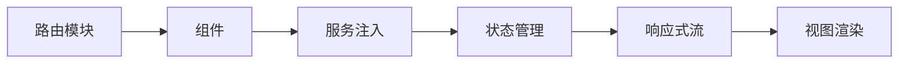

## 是什么

Angular 是 Google 出品的企业级前端框架，自带依赖注入（Dependency Injection）、路由、表单、HTTP 一整套能力。
用它的效果是：大型团队协作时约定多过自由发挥，新人接手老项目的学习成本被显著压低。

## 怎么用

1. 先按业务领域划分模块（Module）与路由，让代码结构对应组织结构。
2. 用依赖注入管理服务与状态，让组件保持轻薄而业务逻辑可被独立测试。
3. 通过响应式表单（Reactive Forms）处理复杂校验，让表单逻辑显式而不藏在模板里。
4. 用 RxJS 编排异步流，让数据流与副作用都有统一的描述方式。
5. 通过 Angular CLI 与 Schematics 做工程化约束，让规范由工具而不是口头传达。

## 架构图




# Angular Patterns

Modern Angular (v17+) conventions using standalone components, signals, and typed forms.

## When to Activate

- Creating or refactoring Angular components, services, or directives
- Choosing between signals, RxJS, or NgRx for state
- Setting up routing with guards, resolvers, or lazy loading
- Building reactive or template-driven forms with validation
- Writing Angular tests (TestBed, jasmine, or jest)
- Configuring HttpClient with interceptors or typed responses
- Optimizing change detection with `OnPush`

---

## Project Structure

```
src/
├── app/
│   ├── core/               # Singleton services, interceptors, guards (provided in root)
│   │   ├── services/
│   │   ├── interceptors/
│   │   └── guards/
│   ├── shared/             # Reusable standalone components, pipes, directives
│   │   ├── components/
│   │   ├── pipes/
│   │   └── directives/
│   ├── features/           # Feature modules — each is a route subtree
│   │   ├── users/
│   │   │   ├── user-list/
│   │   │   ├── user-detail/
│   │   │   └── users.routes.ts
│   │   └── orders/
│   ├── app.component.ts
│   ├── app.config.ts       # bootstrapApplication providers
│   └── app.routes.ts
```

---

## Standalone Components (Angular 17+)

No NgModule required. Default for all new components.

```typescript
import { Component, inject, signal, computed } from '@angular/core';
import { CommonModule } from '@angular/common';
import { RouterLink } from '@angular/router';
import { UserService } from '../core/services/user.service';

@Component({
  selector: 'app-user-list',
  standalone: true,
  imports: [CommonModule, RouterLink],  // import what you use
  changeDetection: ChangeDetectionStrategy.OnPush,
  template: `
    <ul>
      @for (user of users(); track user.id) {
        <li>
          <a [routerLink]="['/users', user.id]">{{ user.name }}</a>
        </li>
      }
      @empty { <li>No users found.</li> }
    </ul>
  `,
})
export class UserListComponent {
  private userService = inject(UserService);   // inject() instead of constructor DI
  users = this.userService.users;              // signal from service
}
```

### New Control Flow (Angular 17+)

Prefer `@if`, `@for`, `@switch` over `*ngIf`, `*ngFor`:

```html
@if (isLoading()) {
  <app-spinner />
} @else if (error()) {
  <app-error [message]="error()" />
} @else {
  <app-data-table [rows]="data()" />
}

@for (item of items(); track item.id) {
  <app-item [item]="item" />
} @empty {
  <p>Nothing here.</p>
}

@switch (status()) {
  @case ('active')   { <span class="green">Active</span> }
  @case ('inactive') { <span class="red">Inactive</span> }
  @default           { <span>Unknown</span> }
}
```

---

## Signals

Signals replace `BehaviorSubject` for synchronous local and service state.

```typescript
import { signal, computed, effect } from '@angular/core';

// Writable signal
const count = signal(0);
count.set(5);
count.update(n => n + 1);
count();        // read — always call as a function

// Computed — automatically tracks dependencies
const doubled = computed(() => count() * 2);

// Effect — runs when dependencies change (use sparingly)
effect(() => {
  console.log('count changed:', count());
});
```

### Signals in Services

```typescript
@Injectable({ providedIn: 'root' })
export class UserService {
  private http = inject(HttpClient);

  // Private writable, public readonly
  private _users = signal<User[]>([]);
  readonly users = this._users.asReadonly();

  readonly activeUsers = computed(() =>
    this._users().filter(u => u.active)
  );

  load() {
    this.http.get<User[]>('/api/users').subscribe(users => {
      this._users.set(users);
    });
  }

  add(user: User) {
    this._users.update(list => [...list, user]);
  }
}
```

### toSignal / toObservable — bridging signals ↔ RxJS

```typescript
import { toSignal, toObservable } from '@angular/core/rxjs-interop';

// Convert Observable to Signal (use in components instead of async pipe)
readonly users = toSignal(this.http.get<User[]>('/api/users'), {
  initialValue: [] as User[],
});

// Convert Signal to Observable (pass to RxJS operators)
const count$ = toObservable(this.count);
count$.pipe(debounceTime(300)).subscribe(...);
```

---

## Dependency Injection

```typescript
// Provided in root (singleton for the whole app)
@Injectable({ providedIn: 'root' })
export class AuthService { ... }

// Provided in a specific component subtree (new instance per component)
@Component({
  providers: [LocalCartService],  // scoped to this component and its children
})

// inject() function — preferred over constructor injection
export class MyComponent {
  private auth = inject(AuthService);
  private router = inject(Router);
}

// Injection tokens for non-class values
export const API_URL = new InjectionToken<string>('API_URL');

// app.config.ts
export const appConfig: ApplicationConfig = {
  providers: [
    { provide: API_URL, useValue: 'https://api.example.com' },
    provideHttpClient(withInterceptors([authInterceptor])),
    provideRouter(routes),
  ],
};

// Usage
private apiUrl = inject(API_URL);
```

---

## HttpClient

```typescript
@Injectable({ providedIn: 'root' })
export class UserService {
  private http = inject(HttpClient);
  private apiUrl = inject(API_URL);

  getUsers(): Observable<User[]> {
    return this.http.get<User[]>(`${this.apiUrl}/users`);
  }

  createUser(data: CreateUserDto): Observable<User> {
    return this.http.post<User>(`${this.apiUrl}/users`, data);
  }

  updateUser(id: string, data: Partial<User>): Observable<User> {
    return this.http.patch<User>(`${this.apiUrl}/users/${id}`, data);
  }

  deleteUser(id: string): Observable<void> {
    return this.http.delete<void>(`${this.apiUrl}/users/${id}`);
  }
}
```

### Functional Interceptors (Angular 15+)

```typescript
// core/interceptors/auth.interceptor.ts
import { HttpInterceptorFn } from '@angular/common/http';
import { inject } from '@angular/core';

export const authInterceptor: HttpInterceptorFn = (req, next) => {
  const auth = inject(AuthService);
  const token = auth.getToken();

  if (!token) return next(req);

  return next(req.clone({
    setHeaders: { Authorization: `Bearer ${token}` },
  }));
};

// core/interceptors/error.interceptor.ts
export const errorInterceptor: HttpInterceptorFn = (req, next) => {
  return next(req).pipe(
    catchError((error: HttpErrorResponse) => {
      if (error.status === 401) inject(AuthService).logout();
      if (error.status === 0) console.error('Network error');
      return throwError(() => error);
    }),
  );
};

// app.config.ts
provideHttpClient(withInterceptors([authInterceptor, errorInterceptor]))
```

---

## Routing

```typescript
// app.routes.ts
import { Routes } from '@angular/router';

export const routes: Routes = [
  { path: '', redirectTo: '/dashboard', pathMatch: 'full' },
  { path: 'dashboard', component: DashboardComponent },

  // Lazy-loaded feature route
  {
    path: 'users',
    loadChildren: () => import('./features/users/users.routes').then(m => m.USERS_ROUTES),
  },

  // Protected route
  {
    path: 'admin',
    canActivate: [authGuard],
    loadChildren: () => import('./features/admin/admin.routes').then(m => m.ADMIN_ROUTES),
  },

  { path: '**', component: NotFoundComponent },
];

// features/users/users.routes.ts
export const USERS_ROUTES: Routes = [
  { path: '',    component: UserListComponent },
  { path: ':id', component: UserDetailComponent,
    resolve: { user: userResolver } },
];
```

### Guards and Resolvers

```typescript
// Functional guard (Angular 14+)
export const authGuard: CanActivateFn = (route, state) => {
  const auth = inject(AuthService);
  const router = inject(Router);
  if (auth.isLoggedIn()) return true;
  return router.createUrlTree(['/login'], { queryParams: { returnUrl: state.url } });
};

// Functional resolver
export const userResolver: ResolveFn<User> = (route) => {
  return inject(UserService).getUser(route.paramMap.get('id')!);
};

// Component reads resolved data
export class UserDetailComponent {
  private route = inject(ActivatedRoute);
  user = toSignal(this.route.data.pipe(map(d => d['user'] as User)));
}
```

---

## Forms

### Reactive Forms (preferred for complex forms)

```typescript
import { FormBuilder, Validators, AbstractControl } from '@angular/forms';

@Component({
  imports: [ReactiveFormsModule],
  template: `
    <form [formGroup]="form" (ngSubmit)="submit()">
      <input formControlName="email" />
      @if (email.invalid && email.touched) {
        <span>{{ emailError() }}</span>
      }
      <input type="password" formControlName="password" />
      <button type="submit" [disabled]="form.invalid">Save</button>
    </form>
  `,
})
export class UserFormComponent {
  private fb = inject(FormBuilder);

  form = this.fb.group({
    email:    ['', [Validators.required, Validators.email]],
    password: ['', [Validators.required, Validators.minLength(8)]],
  });

  get email() { return this.form.controls.email; }

  emailError = computed(() => {
    if (this.email.hasError('required')) return 'Email is required';
    if (this.email.hasError('email'))    return 'Invalid email format';
    return '';
  });

  submit() {
    if (this.form.invalid) return;
    console.log(this.form.getRawValue());
  }
}
```

### Custom Validator

```typescript
function noSpaces(control: AbstractControl) {
  return control.value?.includes(' ')
    ? { noSpaces: 'Username cannot contain spaces' }
    : null;
}

// Async validator (e.g. check username availability)
function uniqueUsername(userService: UserService): AsyncValidatorFn {
  return (control) =>
    userService.checkUsername(control.value).pipe(
      map(taken => taken ? { usernameTaken: true } : null),
      catchError(() => of(null)),
    );
}
```

### Template-Driven Forms (simple forms only)

```typescript
@Component({
  imports: [FormsModule],
  template: `
    <form #f="ngForm" (ngSubmit)="submit(f)">
      <input name="name" ngModel required #nameField="ngModel" />
      @if (nameField.invalid && nameField.touched) {
        <span>Name is required</span>
      }
      <button type="submit" [disabled]="f.invalid">Save</button>
    </form>
  `,
})
export class SimpleFormComponent {
  submit(form: NgForm) {
    if (form.valid) console.log(form.value);
  }
}
```

---

## RxJS in Angular

Common operators used in Angular services and components:

```typescript
// switchMap — cancel previous, use latest (search, route params)
this.searchControl.valueChanges.pipe(
  debounceTime(300),
  distinctUntilChanged(),
  switchMap(query => this.search(query)),  // cancels in-flight on new keystroke
).subscribe(results => this._results.set(results));

// combineLatest — react when any input changes
combineLatest([this.userId$, this.filter$]).pipe(
  switchMap(([id, filter]) => this.loadOrders(id, filter)),
).subscribe(orders => this._orders.set(orders));

// takeUntilDestroyed — auto-unsubscribe when component destroys (Angular 16+)
import { takeUntilDestroyed } from '@angular/core/rxjs-interop';

this.data$.pipe(takeUntilDestroyed()).subscribe(...);

// shareReplay — multicast HTTP call so multiple subscribers don't cause multiple requests
readonly users$ = this.http.get<User[]>('/api/users').pipe(
  shareReplay(1),
);
```

---

## Change Detection

`OnPush` skips re-render unless: an `@Input()` reference changes, a signal read in the template changes, an Observable piped with `async` emits, or `markForCheck()` is called.

```typescript
@Component({
  changeDetection: ChangeDetectionStrategy.OnPush,
  template: `
    <p>{{ title }}</p>
    <p>{{ count() }}</p>          <!-- signal: auto-tracked -->
    <p>{{ data$ | async }}</p>    <!-- observable: tracked by async pipe -->
  `,
})
export class MyComponent {
  @Input() title = '';            // change detection on reference change
  count = signal(0);              // change detection on signal change
  data$ = this.service.data$;     // change detection on async pipe emit
}
```

**Always use `OnPush`** for new components. Combine with signals or `async` pipe — avoid manual `markForCheck()`.

---

## Pipes

```typescript
// Custom pure pipe (re-runs only when input changes)
@Pipe({ name: 'truncate', standalone: true })
export class TruncatePipe implements PipeTransform {
  transform(value: string, limit = 100, trail = '…'): string {
    return value.length > limit ? value.slice(0, limit) + trail : value;
  }
}

// Usage in template
{{ longText | truncate:50 }}
{{ longText | truncate:50:'...' }}

// Impure pipe (re-runs on every change detection cycle) — use sparingly
@Pipe({ name: 'filter', standalone: true, pure: false })
```

Built-in pipes: `date`, `currency`, `number`, `percent`, `json`, `async`, `keyvalue`, `titlecase`, `uppercase`, `lowercase`, `slice`.

---

## Custom Directives

```typescript
// Attribute directive — adds behaviour to host element
@Directive({ selector: '[appHighlight]', standalone: true })
export class HighlightDirective {
  @Input('appHighlight') color = 'yellow';

  private el = inject(ElementRef);
  private renderer = inject(Renderer2);

  @HostListener('mouseenter') onEnter() {
    this.renderer.setStyle(this.el.nativeElement, 'background', this.color);
  }
  @HostListener('mouseleave') onLeave() {
    this.renderer.removeStyle(this.el.nativeElement, 'background');
  }
}

// Usage
<p appHighlight="lightblue">Hover me</p>
```

---

## NgRx (when signals aren't enough)

Use NgRx when: multiple features share state, you need time-travel debugging, or complex side effects via Effects.

```typescript
// state/user.actions.ts
import { createActionGroup, emptyProps, props } from '@ngrx/store';

export const UserActions = createActionGroup({
  source: 'Users',
  events: {
    'Load Users':         emptyProps(),
    'Load Users Success': props<{ users: User[] }>(),
    'Load Users Failure': props<{ error: string }>(),
  },
});

// state/user.reducer.ts
const initialState: UserState = { users: [], loading: false, error: null };

export const userReducer = createReducer(
  initialState,
  on(UserActions.loadUsers,         state => ({ ...state, loading: true })),
  on(UserActions.loadUsersSuccess,  (state, { users }) => ({ ...state, users, loading: false })),
  on(UserActions.loadUsersFailure,  (state, { error }) => ({ ...state, error, loading: false })),
);

// state/user.effects.ts
export const loadUsersEffect = createEffect(
  (actions$ = inject(Actions), userService = inject(UserService)) =>
    actions$.pipe(
      ofType(UserActions.loadUsers),
      switchMap(() =>
        userService.getUsers().pipe(
          map(users => UserActions.loadUsersSuccess({ users })),
          catchError(e => of(UserActions.loadUsersFailure({ error: e.message }))),
        ),
      ),
    ),
  { functional: true },
);

// Component
store.dispatch(UserActions.loadUsers());
users = toSignal(store.select(selectAllUsers));
```

---

## Testing

### Component Tests (TestBed)

```typescript
import { ComponentFixture, TestBed } from '@angular/core/testing';
import { By } from '@angular/platform-browser';

describe('UserListComponent', () => {
  let fixture: ComponentFixture<UserListComponent>;
  let userService: jasmine.SpyObj<UserService>;

  beforeEach(async () => {
    userService = jasmine.createSpyObj('UserService', ['getUsers']);
    userService.getUsers.and.returnValue(of([{ id: '1', name: 'Alice' }]));

    await TestBed.configureTestingModule({
      imports: [UserListComponent],              // standalone: import directly
      providers: [{ provide: UserService, useValue: userService }],
    }).compileComponents();

    fixture = TestBed.createComponent(UserListComponent);
    fixture.detectChanges();
  });

  it('renders a user', () => {
    const item = fixture.debugElement.query(By.css('li'));
    expect(item.nativeElement.textContent).toContain('Alice');
  });

  it('calls service on init', () => {
    expect(userService.getUsers).toHaveBeenCalled();
  });
});
```

### Service Tests

```typescript
describe('UserService', () => {
  let service: UserService;
  let httpMock: HttpTestingController;

  beforeEach(() => {
    TestBed.configureTestingModule({
      providers: [UserService, provideHttpClientTesting()],
    });
    service = TestBed.inject(UserService);
    httpMock = TestBed.inject(HttpTestingController);
  });

  afterEach(() => httpMock.verify());  // ensure no unexpected requests

  it('fetches users', () => {
    service.getUsers().subscribe(users => {
      expect(users.length).toBe(1);
      expect(users[0].name).toBe('Alice');
    });

    const req = httpMock.expectOne('/api/users');
    expect(req.request.method).toBe('GET');
    req.flush([{ id: '1', name: 'Alice' }]);
  });
});
```

---

## Common Pitfalls

| Pitfall | Fix |
|---|---|
| Memory leaks from subscriptions | Use `takeUntilDestroyed()` or `async` pipe |
| `ExpressionChangedAfterItHasBeenCheckedError` | Don't mutate state during change detection; use `OnPush` + signals |
| Injecting in constructor when using `inject()` | Pick one — don't mix constructor params and `inject()` in the same class |
| `*ngFor` without `trackBy` on large lists | Add `track item.id` (new syntax) or `trackBy` function |
| Impure pipe causing performance issues | Switch to pure pipe + signal/async pipe combination |
| Importing `BrowserModule` in feature modules | Only import in `app.config.ts`; use `CommonModule` or standalone imports in features |
| Forgetting to unsubscribe from route params | Use `toSignal(this.route.paramMap)` or `takeUntilDestroyed()` |

---

## Red Flags

- **`ChangeDetectionStrategy.Default` on new components** — Default CD runs on every browser event across the entire tree; all new components should use `OnPush` and rely on signals or the `async` pipe
- **Subscribing in a component without unsubscribing** — a bare `subscribe()` without `takeUntilDestroyed()`, the `async` pipe, or an `ngOnDestroy` unsubscribe creates a memory leak
- **`any` type in templates** — Angular's `strictTemplates` flag catches type mismatches at compile time; `any` silences the check and defers the error to runtime
- **Service provided in a component's `providers` array** — a component-provided service creates a new instance per component; for singleton behavior, provide at the module or root level
- **Mixing `[(ngModel)]` and reactive forms in the same component** — template-driven and reactive form approaches manage state separately and conflict when mixed; pick one approach per form
- **Direct DOM manipulation bypassing Angular's abstractions** — accessing the DOM directly breaks SSR and bypasses change detection; use `Renderer2`, the CDK, or signals
- **Forgetting `markForCheck()` after async updates in `OnPush` components** — signals and the `async` pipe trigger CD automatically; manually pushed non-signal updates in `OnPush` require explicit `markForCheck()`

## Checklist

- [ ] All new components are standalone with `ChangeDetectionStrategy.OnPush`
- [ ] `inject()` used instead of constructor injection
- [ ] Signals used for local and service state (not `BehaviorSubject` for new code)
- [ ] `toSignal()` used in templates instead of `async` pipe where possible
- [ ] All subscriptions cleaned up with `takeUntilDestroyed()` or `async` pipe
- [ ] Reactive forms used for complex forms; typed with `FormBuilder`
- [ ] Lazy loading applied to all feature routes
- [ ] Functional guards and resolvers (not class-based)
- [ ] Functional interceptors (not class-based)
- [ ] HttpClient responses typed with generics (`http.get<User[]>(...)`)
- [ ] Tests use `jasmine.createSpyObj` for service dependencies, not real services
