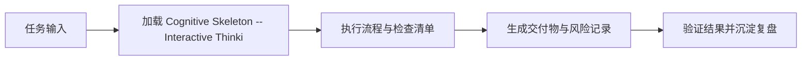

# Cognitive Skeleton -- Interactive Thinking Model Lookup

211 thinking models (111 Decision Framework mental models + 100 PM frameworks) organized into 9 decision scenarios. This skill routes the user's situation to the right models and provides full detail for each.

## When To Use

- The user faces a decision and needs a structured thinking approach
- The user asks "which framework should I use" or "how should I analyze this"
- A strategic, product, or business question benefits from multi-model analysis
- The user wants to combine Decision Framework-style cognitive lenses with PM execution tools
- The user mentions a specific scenario (risk, growth, prioritization, etc.)

## Source Files

- **Master index**: `knowledge/models/COGNITIVE_SKELETON.md` -- scenario routing table with all 211 models
- **Decision Framework detail files** (8 files, 111 models): `knowledge/models/munger/01-general.md` through `08-military.md`
- **PM detail files** (7 files, 100 frameworks): `knowledge/models/pmframes/01-discovery.md` through `07-systems.md`

Each detail entry contains: Trigger / Lens (or Steps) / Action (or Output) / Example / Cross-link (PM-Link or Decision Framework-Link).

## Workflow

### Step 1: Understand the Situation

Ask one clarifying question if the user's situation is ambiguous. If the situation is clear, skip directly to routing.

### Step 2: Route to Scenario

Read `knowledge/models/COGNITIVE_SKELETON.md` and identify which of the 9 scenarios best matches:

1. **Understanding Users** -- don't know what users want, behavior assumptions, user profiles, long-term patterns
2. **Defining Problems** -- symptom vs root cause, complex multi-factor, vague problem, macro environment, industry structure
3. **Generating Solutions** -- stuck/no ideas, systematic innovation, cross-industry inspiration, value proposition, reshape market
4. **Validating & Testing** -- unproven hypothesis, data-driven decision, pre-dev validation, UX quality, filtering weak ideas
5. **Prioritizing & Deciding** -- too many features, quick ROI, unclear decision roles, feature layering, strategic planning
6. **Execution & Delivery** -- sprint planning, scope control, process optimization, feedback collection
7. **Growth & Scaling** -- funnel optimization, habit formation, self-reinforcing growth, PMF, market expansion, GTM
8. **Risk & Resilience** -- what could go wrong, system fragility, competitive defense, resource overstretch, cognitive bias
9. **Systems & Strategy** -- platform design, value chain, lifecycle strategy, system bottleneck, recurring problems

### Step 3: Recommend Models (2-3 Decision Framework + 2-3 PM)

From the matched scenario's table rows, select the most relevant models. Total recommendation: 3-5 models maximum.

For each recommended model, read the corresponding detail file and provide the full entry:
- **Decision Framework model**: Trigger / Lens / Action / Example / PM-Link
- **PM framework**: Trigger / Steps / Output / Decision Framework-Link

### Step 4: Explain the Latticework

The highest-value part of this skill is the cross-reference between Decision Framework and PM models. For each recommendation set, explain:

1. **Why these models connect**: the Decision Framework lens reveals the underlying dynamic; the PM tool operationalizes it
2. **Combination effect**: what you see when you apply both lenses together that neither shows alone
3. **Sequence suggestion**: which to apply first and why (usually: Decision Framework lens to understand the situation, then PM tool to act)

### Step 5: Output Format

```
## Situation Analysis
[One sentence restating the user's situation and the matched scenario]

## Recommended Models

### Decision Framework Lenses (understand WHY)

**#XXX [Name]**
- Trigger: ...
- Lens: ...
- Action: ...
- Example: ...
- Why it fits your situation: [1-2 sentences]

[repeat for 2-3 models]

### PM Tools (execute HOW)

**#XX [Name]**
- Trigger: ...
- Steps: ...
- Output: ...
- Why it fits your situation: [1-2 sentences]

[repeat for 2-3 frameworks]

## Latticework: How They Connect
[2-3 paragraphs explaining the cross-references, combination effects, and suggested application sequence]

## Next Step
[One concrete action the user can take right now with these models]
```

## Gotchas

- Do not recommend more than 5 models total. The entire point of a thinking framework is to focus attention; dumping 10 models on someone is the same as dumping none. Cognitive overload defeats the purpose because the user will not apply any of them deeply.

- The model tells you HOW to think, not WHAT to decide. It is a lens, not an answer. If you present a model as if it produces the decision automatically ("use Inversion, therefore you should X"), you have misrepresented it. The model structures the analysis; the user makes the judgment.

- Cross-references between Decision Framework and PM are the highest-value output. A Decision Framework lens alone explains why something works but not what to do about it. A PM tool alone gives steps but not the underlying principle. The connection is where insight happens -- always explain why a Decision Framework lens and a PM tool complement each other for this specific situation.

- If the user's situation spans multiple scenarios, pick the ONE that addresses the root question. Users often describe symptoms that touch 2-3 scenarios (e.g. "our growth stalled and we don't know what users want"). The root question is usually one scenario (Understanding Users), and the others are consequences. Route to the root, not the symptoms.

- Do not read all 15 detail files upfront. Use progressive disclosure: read `COGNITIVE_SKELETON.md` for routing, then read only the specific detail files for recommended models. The index is T1 (~3K tokens); detail files are T2 (read on demand).

## Examples

### Example 1: "We have too many feature requests and limited engineering time"

**Scenario**: #5 Prioritizing & Deciding -- "Too many features, limited resources"

**Recommended models**:
- Decision Framework #027 80/20 Rule (80/20 principle -- most impact from few features)
- Decision Framework #093 Opportunity Cost (every feature you build means another you don't)
- PM #61 RICE (systematic scoring: Reach x Impact x Confidence / Effort)
- PM #62 MoSCoW (Must/Should/Could/Won't classification)

**Latticework**: 80/20 Rule tells you that most user value comes from ~20% of features -- this is the cognitive lens that prevents "build everything equally" thinking. Opportunity Cost forces you to confront what you are giving up with each choice. RICE operationalizes 80/20 Rule into a scoring system so you can rank rather than debate. MoSCoW gives you a shared vocabulary with stakeholders for communicating the result.

### Example 2: "Our product might fail and I want to stress-test the plan"

**Scenario**: #8 Risk & Resilience -- "What could go wrong"

**Recommended models**:
- Decision Framework #001 Inversion (start from failure and work backward)
- Decision Framework #041 Black Swan (low-probability, high-impact events you are ignoring)
- PM #97 Antifragile Design (design systems that benefit from stress)
- PM Pre-mortem (assume failure happened, brainstorm causes)

**Latticework**: Inversion is the meta-skill -- instead of asking "how do we succeed," ask "how do we definitely fail" and avoid those paths. Black Swan adds the dimension Inversion misses: the risks you cannot even enumerate because they are outside your experience. Pre-mortem is the PM execution of Inversion (team exercise format). Antifragile Design goes beyond risk mitigation to building systems that actually improve under stress.

### Example 3: "We need to understand what our users really want"

**Scenario**: #1 Understanding Users -- "Don't know what users want"

**Recommended models**:
- Decision Framework #007 Map Is Not the Territory (your data model is not reality)
- Decision Framework #078 Narrative Instinct (users tell stories, not facts)
- PM #01 Design Thinking (Empathize -> Define -> Ideate -> Prototype -> Test)
- PM #04 JTBD (what job is the user hiring your product to do)

**Latticework**: Map Is Not the Territory tells you why your existing dashboard/survey data may be misleading -- it is a simplified model of reality, not reality itself. Narrative Instinct explains why user interviews produce stories rather than reliable data, so you need techniques that look past the narrative to actual behavior. Design Thinking gives you the full process from empathy to validation. JTBD gives you the specific analytical frame for the "Define" step: what functional, emotional, and social job is the user trying to accomplish.

## 是什么

Cognitive Skeleton -- Interactive Thinking Model Lookup 用来把 战略圆桌顾问 场景里的任务输入转成可执行的流程、检查清单和交付物。

Use when: decision-making, strategy, risk assessment, problem analysis, growth planning, or when the user asks 'which framework/model should I use'. Trigger: 思维模型, mental model, framework, 该用什么框架, 怎么分析, 决策, 战略, 决策框架, munger, lattice, 格栅....

它的价值在于让 战略决策线 在 Claude Code、Codex、Gemini、Hermes 或 OpenClaw 中复用同一套岗位能力，而不是依赖一次性的聊天提示词。

## 怎么用

1. 明确当前任务目标、输入材料、约束和期望交付物，再加载 `cognitive-skeleton`。
2. 按 skill 文档中的流程、检查清单或工具建议执行，优先复用仓库已有规范与真实命令。
3. 把关键判断、风险、验证命令和产出路径记录到当前任务文档或交付说明中。
4. 用最小可证明的检查确认结果有效；发现缺口时回到 skill 清单补齐。

## 架构图


