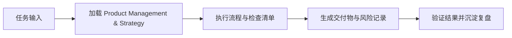

# Product Management & Strategy

> SWARM (parallel experts, dynamic selection) | 产品战略、用户研究、市场分析、功能优先级、商业模型、竞品分析

## Skills (97 available)
- `ansoff-matrix`
- `beachhead-segment`
- `brainstorm-experiments-existing`
- `brainstorm-experiments-new`
- `brainstorm-ideas-existing`
- `brainstorm-ideas-new`
- `brainstorm-okrs`
- `business-model`
- `competitive-battlecard`
- `competitor-analysis`
- `compliance`
- `create-prd`
- `customer-journey-map`
- `draft-nda`
- `growth-loops`
- `gtm-motions`
- `gtm-strategy`
- `ideal-customer-profile`
- `identify-assumptions-existing`
- `identify-assumptions-new`
- `interview-script`
- `job-stories`
- `lean-canvas`
- `market-segments`
- `market-sizing`
- `marketing-ideas`
- `marketing-skills`
- `metrics-dashboard`
- `monetization-strategy`
- `north-star-metric`
- `opportunity-solution-tree`
- `outcome-roadmap`
- `pestle-analysis`
- `pm-cmd-analyze-cohorts`
- `pm-cmd-analyze-feedback`
- `pm-cmd-analyze-test`
- `pm-cmd-battlecard`
- `pm-cmd-brainstorm`
- `pm-cmd-business-model`
- `pm-cmd-competitive-analysis`
- `pm-cmd-discover`
- `pm-cmd-draft-nda`
- `pm-cmd-generate-data`
- `pm-cmd-growth-strategy`
- `pm-cmd-interview`
- `pm-cmd-market-product`
- `pm-cmd-market-scan`
- `pm-cmd-meeting-notes`
- `pm-cmd-north-star`
- `pm-cmd-plan-launch`
- `pm-cmd-plan-okrs`
- `pm-cmd-pre-mortem`
- `pm-cmd-pricing`
- `pm-cmd-privacy-policy`
- `pm-cmd-proofread`
- `pm-cmd-research-users`
- `pm-cmd-review-resume`
- `pm-cmd-setup-metrics`
- `pm-cmd-sprint`
- `pm-cmd-stakeholder-map`
- `pm-cmd-strategy`
- `pm-cmd-tailor-resume`
- `pm-cmd-test-scenarios`
- `pm-cmd-transform-roadmap`
- `pm-cmd-triage-requests`
- `pm-cmd-value-proposition`
- `pm-cmd-write-prd`
- `pm-cmd-write-query`
- `pm-cmd-write-stories`
- `industry-forces`
- `positioning-ideas`
- `pre-mortem`
- `pricing-strategy`
- `prioritization-frameworks`
- `prioritize-assumptions`
- `prioritize-features`
- `privacy-policy`
- `product-name`
- `product-strategy`
- `product-tri-ownership`
- `product-vision`
- `release-notes`
- `review-resume`
- `rpi-implement`
- `rpi-plan`
- `rpi-research`
- `stakeholder-map`
- `startup-canvas`
- `swot-analysis`
- `test-scenarios`
- `tri-ownership`
- `user-personas`
- `user-segmentation`
- `user-stories`
- `value-prop-statements`
- `value-proposition`
- `wwas`

## How to Use
1. Match the user's task to the most relevant sub-skill above
2. Read the matching canonical skill file in this repo (for example `skills/shared/<skill-name>/SKILL.md`, `skills_infra/shared/<skill-name>/SKILL.md`, or `layers/L3-intelligence/skills/skills/<skill-name>/SKILL.md`) or the installed host mirror when working outside the repo
3. Follow the SPEC.md instructions
4. If multiple skills apply, combine their approaches

## 是什么

Product Management & Strategy 用来把 战略圆桌顾问 场景里的任务输入转成可执行的流程、检查清单和交付物。

> SWARM (parallel experts, dynamic selection) | 产品战略、用户研究、市场分析、功能优先级、商业模型、竞品分析

它的价值在于让 战略决策线 在 Claude Code、Codex、Gemini、Hermes 或 OpenClaw 中复用同一套岗位能力，而不是依赖一次性的聊天提示词。

## 怎么用

1. 明确当前任务目标、输入材料、约束和期望交付物，再加载 `product-management-swarm`。
2. 按 skill 文档中的流程、检查清单或工具建议执行，优先复用仓库已有规范与真实命令。
3. 把关键判断、风险、验证命令和产出路径记录到当前任务文档或交付说明中。
4. 用最小可证明的检查确认结果有效；发现缺口时回到 skill 清单补齐。

## 架构图

