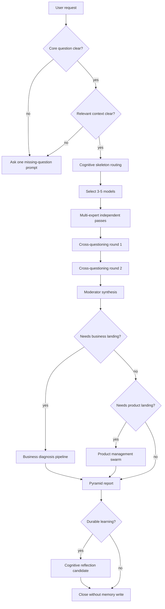

# Tool Kit 03 · Strategic Roundtable SOP Flowchart

## Purpose

This SOP turns an ambiguous strategic request into a structured roundtable and report.

## Operating Steps

### Step 01

Capture the user's exact decision pressure.

### Step 02

Separate decision question from background facts.

### Step 03

Ask only one clarifying question when the missing field blocks analysis.

### Step 04

Use cognitive-skeleton for framework selection when the problem is under-framed.

### Step 05

Use multi-expert-roundtable-report when the user needs challenge and synthesis.

### Step 06

Run two internal disagreement passes before writing the visible report.

### Step 07

Write the management summary first.

### Step 08

Attach risk triggers and emergency moves to every major risk.

### Step 09

Give short, medium, and long horizon actions.

### Step 10

Route business-model questions to business-diagnosis-pipeline.

### Step 11

Route product-roadmap questions to product-management-swarm.

### Step 12

Use planning-with-files when the work needs cross-session memory.

### Step 13

Use cognitive-reflection only for durable rules or postmortem-grade lessons.

### Step 14

Reject raw transcript dumps.

### Step 15

Reject mechanical expert voting.

### Step 16

Reject recommendations without conditions.

### Step 17

Reject reports that do not say what to do next.

### Step 18

Record open assumptions.

### Step 19

Record no-go or pivot conditions.

### Step 20

End with 3-5 high-quality follow-up questions.

## Review Checklist

- [ ] Core question and context are both present.
- [ ] The selected models fit the situation.
- [ ] Disputes are visible, not hidden.
- [ ] The report starts with the answer.
- [ ] Every major recommendation has evidence or an assumption.
- [ ] Every risk has a trigger and response.
- [ ] The next action is executable within 30 days.
- [ ] No raw hidden reasoning transcript is exposed.
