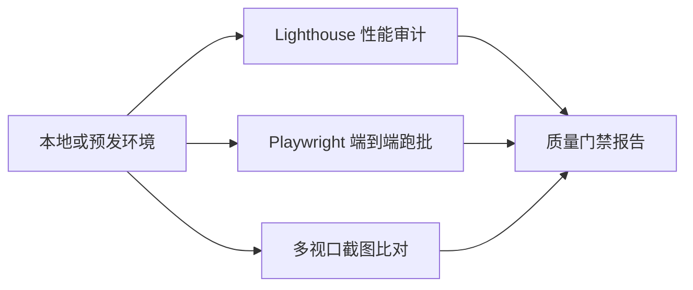

## 是什么

这是一个面向前端 Web 应用的端到端质量验证能力，覆盖性能指标、控制台报错、响应式布局与 E2E（端到端）功能链路，目标是在上线前把用户能感知到的明显缺陷拦在测试阶段，避免用户成为线上 bug 的第一发现人。

## 怎么用

1. 用 Lighthouse（性能与可访问性审计工具）跑出 LCP（最大内容渲染时间）、CLS（累计布局偏移）、TBT（总阻塞时间）三项核心指标，作为本次发布的性能基线。
2. 用 Playwright（端到端测试框架）覆盖关键用户路径，例如登录、下单、提交表单，确保主流程在 Chromium、WebKit、Firefox 三个引擎下都通过。
3. 在多种视口（移动 / 平板 / 桌面）下截图比对，发现响应式布局错位、文字溢出、按钮被遮挡这类视觉缺陷。
4. 监听浏览器 Console（控制台）的 error、warning、network failure，任何一条都视为质量缺陷登记入册，禁止"上线先不管"的处理方式。
5. 把性能指标、E2E 通过率、Console 异常数汇总成一份发布质量报告，作为产品团队判断"能否发布"的事实依据。

## 架构图



# Testing Frontend

## Quick Start

Run Lighthouse audit:
```bash
npx lighthouse http://localhost:3000 --output=json --output-path=./report.json
```

## Requirements

```bash
npm install -D playwright @playwright/test lighthouse
npx playwright install
```

## 5-Step Validation Process

Copy and track:
```
Frontend Validation:
- [ ] Step 1: Network requests (API success)
- [ ] Step 2: Console monitoring (zero errors)
- [ ] Step 3: Performance metrics (Core Web Vitals)
- [ ] Step 4: Responsive testing (3 breakpoints)
- [ ] Step 5: E2E functionality (critical paths)
```

## Step 1: Network Requests

**Target**: All API calls return 2xx status

```javascript
// Playwright network monitoring
test('API calls succeed', async ({ page }) => {
  const failedRequests = [];

  page.on('response', response => {
    if (response.status() >= 400) {
      failedRequests.push({
        url: response.url(),
        status: response.status()
      });
    }
  });

  await page.goto('/');
  expect(failedRequests).toHaveLength(0);
});
```

## Step 2: Console Errors

**Target**: Zero JavaScript errors

```javascript
test('No console errors', async ({ page }) => {
  const errors = [];

  page.on('console', msg => {
    if (msg.type() === 'error') {
      errors.push(msg.text());
    }
  });

  await page.goto('/');
  await page.waitForLoadState('networkidle');

  expect(errors).toHaveLength(0);
});
```

## Step 3: Performance Metrics

**Targets**:
- LCP (Largest Contentful Paint) < 2.5s
- CLS (Cumulative Layout Shift) < 0.1
- FID (First Input Delay) < 100ms

```javascript
test('Core Web Vitals pass', async ({ page }) => {
  await page.goto('/');

  const metrics = await page.evaluate(() => {
    return new Promise(resolve => {
      new PerformanceObserver(list => {
        const entries = list.getEntries();
        resolve({
          lcp: entries.find(e => e.entryType === 'largest-contentful-paint')?.startTime,
          cls: entries.find(e => e.entryType === 'layout-shift')?.value
        });
      }).observe({ entryTypes: ['largest-contentful-paint', 'layout-shift'] });
    });
  });

  expect(metrics.lcp).toBeLessThan(2500);
  expect(metrics.cls).toBeLessThan(0.1);
});
```

## Step 4: Responsive Testing

**Breakpoints**:
- Desktop: 1920x1080
- Mobile: 375x667 (iPhone SE)
- Tablet: 768x1024 (iPad)

```javascript
const devices = [
  { name: 'Desktop', width: 1920, height: 1080 },
  { name: 'Mobile', width: 375, height: 667 },
  { name: 'Tablet', width: 768, height: 1024 }
];

for (const device of devices) {
  test(`Layout on ${device.name}`, async ({ page }) => {
    await page.setViewportSize({ width: device.width, height: device.height });
    await page.goto('/');
    await page.screenshot({ path: `screenshots/${device.name}.png` });
  });
}
```

## Step 5: E2E Functionality

```javascript
test('Critical user flow', async ({ page }) => {
  // Navigate
  await page.goto('/');

  // Interact
  await page.fill('input[name="email"]', 'test@example.com');
  await page.click('button[type="submit"]');

  // Verify
  await expect(page.locator('.success-message')).toBeVisible();
});
```

## Output Report

```json
{
  "verdict": "PASS|FAIL",
  "network": { "status": "PASS", "failed_requests": 0 },
  "console": { "status": "PASS", "errors": 0 },
  "performance": {
    "lcp": 1200,
    "cls": 0.05,
    "fid": 50,
    "status": "PASS"
  },
  "responsive": { "status": "PASS", "screenshots": [] },
  "e2e": { "status": "PASS", "tests_passed": 5 }
}
```

## Version History
- v1.0.0 (2025-01): Initial release based on CLAUDE.md requirements
