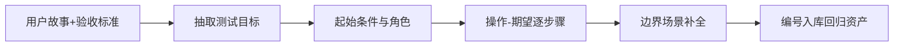

## 是什么

这是一个把用户故事翻译成结构化测试场景的能力，输出包含测试目标、起始条件、用户角色、逐步操作、预期结果五要素的 QA（质量保证）测试用例，让产品、研发、测试三方对"做完是什么样"达成同一份共识。

## 怎么用

1. 拿到用户故事和验收标准后先抽取测试目标，明确这条用例要验证的具体行为，避免"测试一堆点最后什么都没说清"。
2. 把起始条件写清楚，包括环境配置、数据准备、账号角色，让任何一名测试工程师都能照单复现，不必反复问需求方。
3. 用"操作 -> 期望结果"二元结构逐步骤展开，每一步只描述一个动作和一个可观察的结果，便于自动化脚本逐行翻译。
4. 在主路径之外补足边界场景和失败路径，例如空输入、权限不足、网络中断，避免上线后被用户发现"显而易见的角落 bug"。
5. 把每条用例标注唯一编号并归入回归库，作为下次迭代、灰度发布、生产排障时可直接复用的资产。

## 架构图

# Test Scenarios

Create comprehensive test scenarios from user stories with test objectives, starting conditions, user roles, step-by-step test actions, and expected outcomes.

**Use when:** Writing QA test cases, creating test plans, defining acceptance test scenarios, or validating user story implementations.

**Arguments:**
- `$PRODUCT`: The product or system name
- `$USER_STORY`: The user story to test (title and acceptance criteria)
- `$CONTEXT`: Additional testing context or constraints

## Step-by-Step Process

1. **Review the user story** and acceptance criteria
2. **Define test objectives** - What specific behavior to validate
3. **Establish starting conditions** - System state, data setup, configurations
4. **Identify user roles** - Who performs the test actions
5. **Create test steps** - Break down interactions step-by-step
6. **Define expected outcomes** - Observable results after each step
7. **Consider edge cases** - Invalid inputs, boundary conditions
8. **Output detailed test scenarios** - Ready for QA execution

## Scenario Template

**Test Scenario:** [Clear scenario name]

**Test Objective:** [What this test validates]

**Starting Conditions:**
- [System state required]
- [Data or configuration needed]
- [User setup or permissions]

**User Role:** [Who performs the test]

**Test Steps:**
1. [First action and its expected result]
2. [Second action and observable outcome]
3. [Third action and system behavior]
4. [Completion action and final state]

**Expected Outcomes:**
- [Observable result 1]
- [Observable result 2]
- [Observable result 3]

## Example Test Scenario

**Test Scenario:** View Recently Viewed Products on Product Page

**Test Objective:** Verify that the 'Recently viewed' section displays correctly and excludes the current product.

**Starting Conditions:**
- User is logged in or has browser history enabled
- User has viewed at least 2 products in the current session
- User is now on a product page different from previously viewed items

**User Role:** Online Shopper

**Test Steps:**
1. Navigate to any product page → Section should appear at bottom with previously viewed items
2. Scroll to bottom of page → "Recently viewed" section is visible with product cards
3. Verify product thumbnails → Images, titles, and prices are displayed correctly
4. Check current product → Current product is NOT in the recently viewed list
5. Click on a product card → User navigates to the corresponding product page

**Expected Outcomes:**
- Recently viewed section appears only after viewing at least 1 prior product
- Section displays 4-8 product cards with complete information
- Current product is excluded from the list
- Each card shows "Viewed X minutes/hours ago" timestamp
- Clicking cards navigates to correct product pages
- Performance: Section loads within 2 seconds

## Output Deliverables

- Comprehensive test scenarios for each acceptance criterion
- Clear test objectives aligned with user story intent
- Detailed step-by-step test actions
- Observable expected outcomes after each step
- Edge case and error scenario coverage
- Ready for QA team execution and documentation
