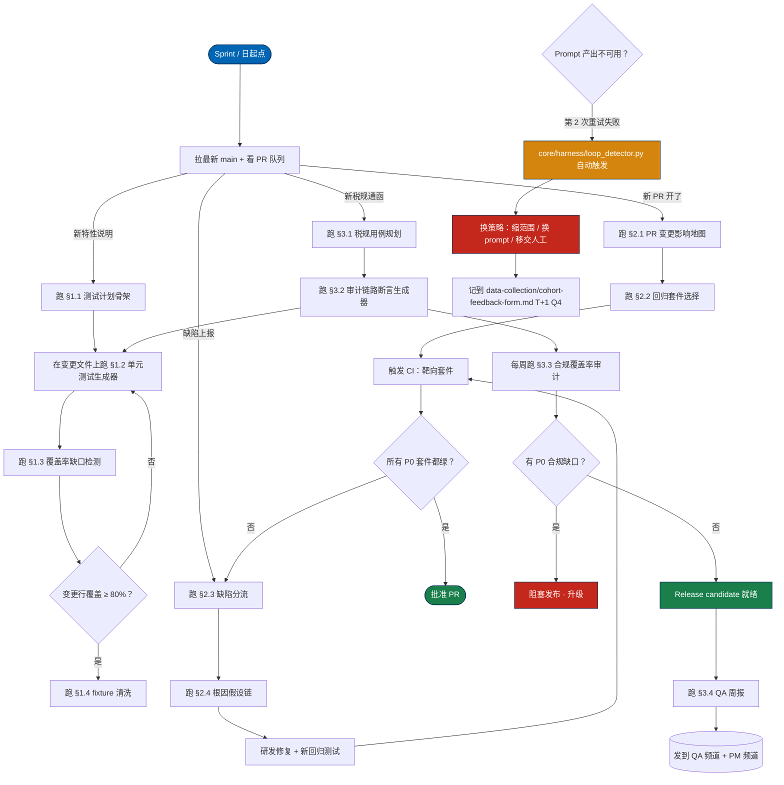

# Tool-Kit 03 · SOP 流程图 · W4 测试 / QA 端到端工作流

> QA 日 / sprint / release 周期的 Mermaid 流程图。打印带到线下场 — 这是你挑 prompt 时参考的 "墙上地图"。
> 通过 node ID 驱动 `core/harness/sop_engine.py`（每个节点是状态机的一个 state）。

## 完整 SOP（≤ 20 节点）

## 节点 ID 索引（用于 `sop_engine.py` 状态机）

| 节点 ID | 状态 | 触发 | 下一状态 |
|---------|------|------|---------|
| `START` | sprint-start | 班次开始 / sprint 启动 | `S1` |
| `S1` | queue-sweep | review PR / 说明 / 缺陷 | 按事件类型分支 |
| `F1A`-`F1D` | coverage-cycle | 新特性或覆盖缺口 | 顺序，通过 `COVQ` 回环 |
| `F2A`-`F2B` | change-impact-cycle | 新 PR 开了 | 顺序 |
| `F2C`-`F2D` | defect-cycle | 缺陷上报 | 顺序，通过 `FIX → RUNCI` 回环 |
| `F3A`-`F3B` | compliance-cycle | 新税规 | 顺序，接 `F1B` |
| `F3C`-`F3D` | weekly-compliance | 周末 | 顺序 |
| `RUNCI` | ci-execution | 靶向套件运行 | `CIQ` |
| `MERGE` | pr-approved | 所有 P0 绿 | 结束 |
| `BLOCK` | release-blocked | 有 P0 合规缺口 | 升级 |
| `HARNESS` | loop-detector | 重试 2 次失败 | `PIVOT` |
| `PIVOT` | strategy-change | 模型卡住 | `LOG` |
| `LOG` | failure-log | 总是 | 下个 cycle 的 `START` |

## 日 / sprint / release 入口

| 节奏 | 入口节点 | 典型时长 | 典型出口 |
|------|---------|---------|---------|
| 每次班次开始 | `START` → `S1` | 15-30 分钟 | 分支进 cycle |
| 每个 PR | `F2A` → `F2B` → `RUNCI` | 30-60 分钟（看套件大小） | `MERGE` 或 `F2C` |
| 每份特性说明 | `F1A` → `F1B` → `F1C` | 90-120 分钟 | `COVQ` 绿 |
| 每条新税规 | `F3A` → `F3B` → `F1B` | 2-4 小时 | 测试提交 |
| 周末 | `F3C` → `F3D` | 45 分钟 | 周报发出 |
| 每个缺陷 | `F2C` → `F2D` → `FIX` | 60-90 分钟 | `RUNCI` 确认修复 |

## 紧急路径

同一个 prompt 在同一输入上失败两次：

1. `core/harness/loop_detector.py` 自动触发（你不用主动调）
2. Harness 把 PIVOT 推荐写到 `state/loop-detector.log`
3. 你读推荐，换策略（缩范围 / 换 prompt / 移交人工）
4. 把失败记到 `data-collection/cohort-feedback-form.md` T+1 Q4 — 这是 Buffer 1 里 `tool-kit-02` v1.1 的输入

不允许同一思路第 3 次重试。Harness 这条规则硬。

## 发布 gate 硬规则（不允许绕过）

- `BLOCK`（P0 合规缺口）要 program owner + tech lead 双签发才能 override；默认动作是升级，不是绕过
- `F2B` 关键路径覆盖率 < 100% → 升级，不允许部分跑；部分跑等于把缺口藏起来
- `F1D` 任何 PII 命中 → 暂停 commit，清洗后继续 — 永远不允许 "之后再修"

## 打印版

挂墙打印用 [Mermaid Live Editor](https://mermaid.live)：粘上面的图块，导出 2× PNG，A3 打印。

---

Agent Foundry Team
